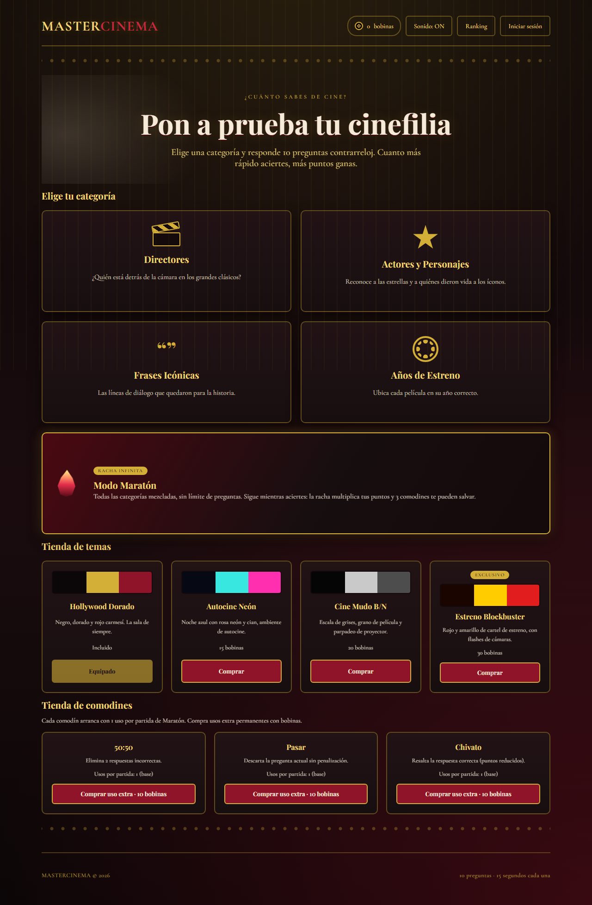
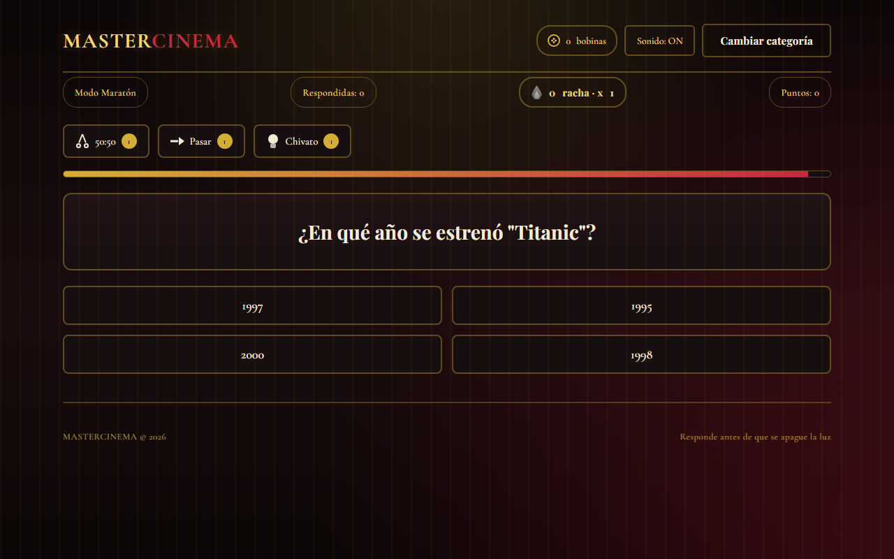
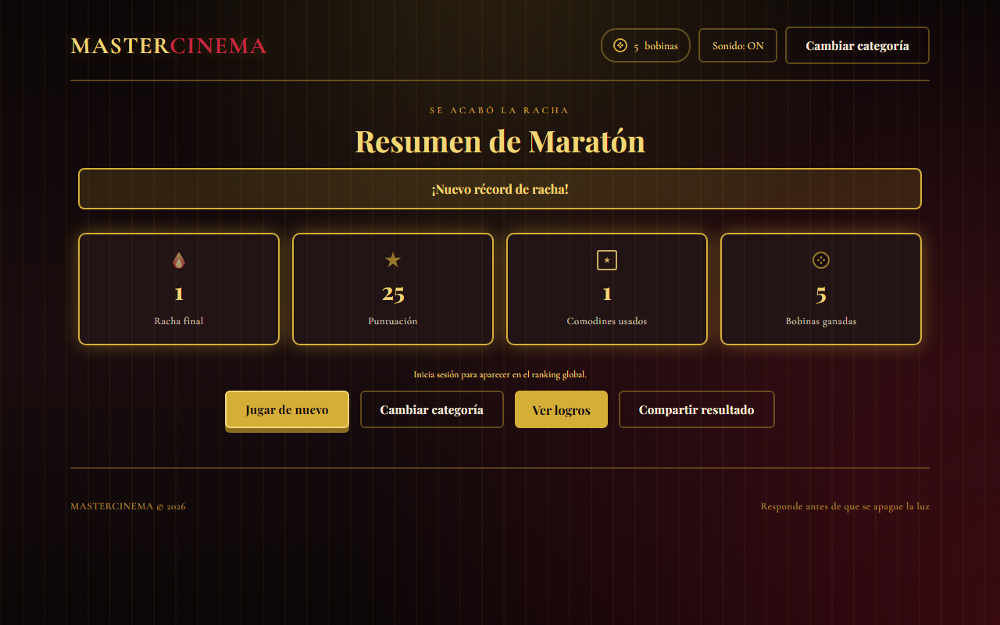
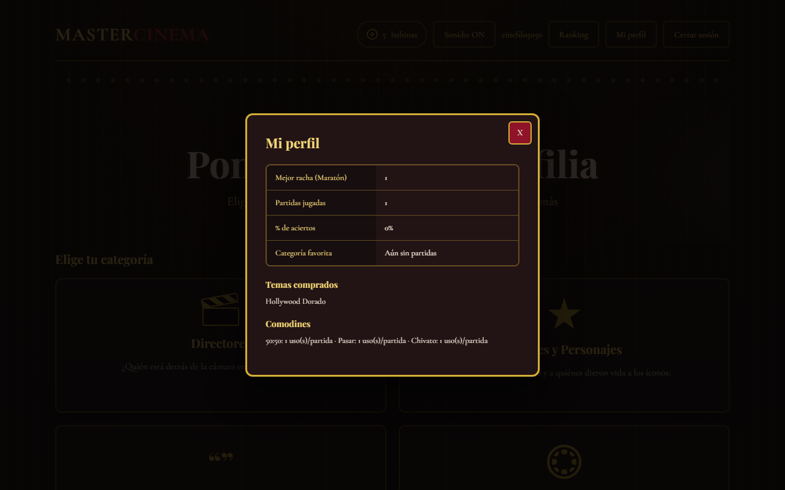

# MasterCinema

[](https://github.com/lucasmarjua-ui/mastercinema/actions/workflows/deploy.yaml)
[](LICENSE)
[](https://lucasmarjua-ui.github.io/mastercinema/)


MasterCinema es un juego de trivia de cine, estático y responsive, con una identidad visual de sala de cine y alfombra roja: rojo carmesí, dorado, negro y tipografía tipo cartel. Hecho con HTML, CSS y JavaScript vanilla, sin frameworks ni build step.

**[▶ Jugar ahora](https://lucasmarjua-ui.github.io/mastercinema/)**

## Jugar localmente

No hay dependencias ni build step. Al usar módulos ES nativos, hace falta servir los archivos (abrir `index.html` con doble clic no funciona por las políticas de CORS de `file://`). Sirve la raíz con cualquier servidor estático, por ejemplo:

```bash
python -m http.server 8000
```

Luego visita `http://localhost:8000`.

## Cómo se juega

1. En la pantalla de inicio, elige una de las cuatro categorías: **Directores**, **Actores y Personajes**, **Frases Icónicas** o **Años de Estreno**.
2. Responde una ronda de 10 preguntas de opción múltiple, elegidas al azar del banco de esa categoría. Cada pregunta tiene un temporizador de 15 segundos (con tic-tac en los últimos 5) y una cortinilla de cine al pasar a la siguiente: si se agota el tiempo, cuenta como fallo.
3. Cada acierto suma puntos (entre 50 y 150, según la rapidez de la respuesta) y reproduce un aplauso con destello dorado; cada fallo suena a buzzer/gong, sacude el botón en rojo y muestra la respuesta correcta. Los fallos no restan puntos.
4. Al terminar las 10 preguntas aparece la pantalla de resultados con aciertos, fallos, puntuación y **bobinas** ganadas (la moneda del juego, según la puntuación), con botones para jugar de nuevo, cambiar de categoría o ver tus **logros**.
5. Las bobinas se gastan en la **tienda de temas** de la pantalla de inicio: 4 paletas visuales completas para equipar.
6. Si inicias sesión (nombre de usuario y contraseña), tu progreso se sincroniza en la nube y tus mejores puntuaciones entran al **ranking global** por categoría.
7. En **Modo Maratón** (quinta tarjeta, distinta a las demás) las preguntas de las 4 categorías se mezclan sin repetir hasta agotar el pool, sin número fijo de preguntas: sigues mientras aciertes. La racha multiplica tus puntos (x1, x1.5 desde 5, x2 desde 10, x3 desde 20) y tienes 3 comodines —**50:50**, **Pasar** y **Chivato**— para salvar una respuesta.

## Arquitectura

```text
index.html                 Pantalla de inicio, categorías, tienda de temas, login y ranking
game.html                  Pantalla de juego: preguntas, temporizador, resultados y logros
shared/theme.css           Paleta, tipografía, layout responsive y temas visuales completos
shared/questions.js        Banco de preguntas por categoría
shared/quiz-engine.js      Selección de preguntas, orden de opciones y puntuación
shared/audio.js            Aplausos, buzzer y tic-tac sintetizados con Web Audio API
shared/wallet.js           Monedero de "bobinas" persistido en localStorage
shared/themes.js           Catálogo de temas visuales, compra y equipamiento
shared/achievements.js     Estadísticas y logros (bronce/plata/oro) por categoría
shared/firebase-config.js  Configuración e inicialización del SDK Firebase CDN
shared/auth.js             Registro, login con usuario/contraseña, invitado y sincronización Firestore
shared/leaderboard.js      Envío y lectura del ranking global en Firestore (por categoría y de mejor racha)
shared/wildcards.js        Catálogo de comodines de Maratón, usos base y compra de usos extra
firestore.rules            Reglas de seguridad del proyecto Firebase (referencia, se pegan en la consola)
.github/workflows/deploy.yaml   Publicación en GitHub Pages en cada push a main
```

## Sonido y sensación de juego

Todos los efectos se sintetizan en tiempo real con la Web Audio API (`shared/audio.js`), sin archivos de audio externos: un aplauso (ráfagas de ruido filtrado) al acertar, un buzzer/gong grave (dos osciladores desafinados) al fallar, y un tic-tac que arranca en los últimos 5 segundos de cada pregunta. El botón **Sonido** silencia todo. Al acertar, el botón elegido destella en dorado (`flash-gold`); al fallar, tiembla en rojo (`shake-wrong`) y se resalta la respuesta correcta. Entre preguntas, y al pasar de la ronda a resultados, se reproduce una cortinilla de cine (`.wipe-bar`): una barra oscura que barre la pantalla de lado a lado mientras cambia el contenido debajo.

## Bobinas y tienda de temas

Cada partida entrega bobinas según la puntuación conseguida (`reelsForScore` en `shared/wallet.js`). La tienda de `index.html` ofrece 4 temas visuales completos —no solo un color de acento, sino toda la paleta vía variables CSS en `[data-theme="id"]`—: **Hollywood Dorado** (incluido), **Autocine Neón** (15 bobinas), **Cine Mudo B/N** (20 bobinas, con grano de película y parpadeo de proyector) y **Estreno Blockbuster** (30 bobinas, exclusivo, con flashes de cámaras al equiparlo).

## Logros

`shared/achievements.js` deriva 16 logros (12 por categoría clásica, bronce/plata/oro, más 4 de Maratón) a partir de estadísticas acumuladas en `localStorage`, nunca de flags guardados aparte. Incluye una racha global entre categorías y un logro meta (oro de Años de Estreno = oro en las otras tres categorías). El botón **Ver logros** de la pantalla de resultados abre el detalle de conseguidos y pendientes.

## Modo Maratón y comodines

`shared/quiz-engine.js` expone `createMarathonDeck()` (mazo con las 4 categorías mezcladas, sin repetir hasta agotar el pool) y `computeMarathonScore()` (puntuación base multiplicada según la racha: x1 de 0 a 4, x1.5 de 5 a 9, x2 de 10 a 19, x3 desde 20). El destello de combo (`Audio.playCombo`) se intensifica en esos mismos tramos, y un destello de confeti (`spawnConfetti` en `game.html`) más un arpegio (`Audio.playRecord`) celebran cada vez que se supera el récord personal de racha (`stats.marathon.bestStreak`, sincronizado en Firestore igual que el resto de estadísticas).

Cada partida arranca con 1 uso de cada comodín (`shared/wildcards.js`): **50:50** (elimina 2 respuestas incorrectas), **Pasar** (descarta la pregunta sin romper la racha) y **Chivato** (resalta la respuesta correcta; cuenta como acierto pero con puntos base reducidos a la mitad, sin bonus por rapidez). La **tienda de comodines** de `index.html` vende usos extra permanentes (10 bobinas cada uno) que se suman al uso base en cada partida nueva.

Al fallar sin comodín que salve la respuesta termina la partida y aparece el **resumen de Maratón**: racha final, puntos, comodines usados y bobinas ganadas (cada tarjeta con su icono y los números contando hacia arriba al aparecer), aviso de nuevo récord si corresponde (con brillo dorado más marcado en las tarjetas), y un botón **Compartir resultado** que copia al portapapeles un texto tipo "He conseguido una racha de X en MasterCinema 🎬🔥". La mejor racha también se envía a un ranking global propio (categoría `marathon-streak` en `leaderboards/`), visible desde el selector de la pantalla **Ranking**.

## Mi perfil

Con sesión iniciada, el botón **Mi perfil** de la cabecera abre un modal con la mejor racha histórica de Maratón, partidas jugadas (categorías + Maratón), porcentaje de aciertos global y categoría favorita (la más jugada), además de los temas y comodines ya comprados. Todo se deriva de `shared/achievements.js` (`getProfileSummary`); los contadores `totalCorrect`/`totalAnswered` por categoría, necesarios para el % de aciertos, se guardan igual que el resto de estadísticas y se fusionan en Firestore con la misma lógica de máximos.

## Cuentas y ranking global (Firebase)

MasterCinema usa un proyecto Firebase propio (`mastercinema-trivia`, Authentication + Firestore), independiente de cualquier otro proyecto. Funciona como invitado sin registro: las bobinas, el tema equipado, las estadísticas y los logros se guardan en `localStorage`. Desde **Iniciar sesión** se puede crear una cuenta o entrar con **nombre de usuario y contraseña** (por debajo usa Firebase Authentication con un email generado internamente a partir del nombre de usuario, `usuario@mastercinema.local`; nunca se pide ni se muestra un email real). Al entrar, el progreso local se fusiona con el documento `users/{uid}` de Firestore.

Al terminar una partida con sesión iniciada, si la puntuación supera la guardada, se envía a `leaderboards/{categoria}/entries/{uid}`. La pantalla **Ranking** (botón en la cabecera de inicio) muestra el top 10 por categoría; como invitado se avisa que hace falta iniciar sesión para aparecer.

### Configuración pendiente en la consola de Firebase

El proyecto y la app web ya están creados (`mastercinema-trivia`), pero **Firestore y el proveedor de email/contraseña no se pueden activar por API ni por CLI** — Google exige un primer clic manual en la consola para cada uno. Sin estos dos pasos, el login y el ranking no funcionarán (el resto de la web sí):

1. Abre la [consola de Firebase del proyecto](https://console.firebase.google.com/project/mastercinema-trivia/overview).
2. **Firestore Database → Crear base de datos** (elige una región, por ejemplo `nam5`) — un solo clic, no hace falta configurar nada más.
3. **Authentication → Comenzar → Sign-in method → Email/contraseña → Habilitar**.
4. **Authentication → Settings → Authorized domains**: añade `lucasmarjua-ui.github.io` para que el login funcione también en GitHub Pages (además de `localhost`, que ya viene autorizado).
5. **Firestore Database → Reglas**: pega el contenido de [`firestore.rules`](firestore.rules) y publica.

Después de estos pasos, cuentas, sincronización y ranking funcionan sin tocar código.

### Cómo agregar preguntas

Cada categoría en `shared/questions.js` es un objeto con `label`, `description` e `items`. Cada `item` tiene `q` (el enunciado), `correct` (la respuesta correcta) y `wrong` (un array con las 3 opciones falsas). No hace falta tocar `game.html` ni `quiz-engine.js`: el motor arma la ronda, baraja el orden de las opciones y recicla el banco si tiene menos de 10 preguntas por categoría.

## Decisiones técnicas

**Sin build step ni frameworks.** Todo el proyecto es HTML, CSS y JavaScript vanilla con módulos ES nativos del navegador. Esto permite que GitHub Pages sirva el repositorio tal cual, sin paso de compilación ni CI de build, y que cualquiera pueda clonar el repositorio y abrir el proyecto sin instalar nada.

**Sin imágenes ni fuentes de terceros con derechos.** No hay carteles ni fotos de películas o actores: toda la identidad visual (claqueta, estrella, comillas, rollo de película) se dibuja con CSS puro (gradientes, `clip-path`, pseudo-elementos), evitando dependencias de assets binarios y problemas de derechos de autor.

**Responsive mobile-first.** El layout usa flexbox/grid con unidades relativas y `clamp()`, botones con una altura mínima de 44px para uso táctil, y media queries que colapsan la grilla de categorías y de respuestas a una sola columna en pantallas pequeñas, sin scroll horizontal.

## Capturas

| | |
|---|---|
|  Vestíbulo: categorías, Modo Maratón y tiendas |  Modo Maratón: racha, multiplicador y comodines |
|  Resumen al terminar la racha |  Mi perfil: estadísticas del jugador |

## GitHub Pages

El workflow `.github/workflows/deploy.yaml` publica los archivos estáticos en cada push a `main`, sin compilación. Después de crear el repositorio, activa Pages una sola vez en **Settings → Pages → Source: GitHub Actions**. Ese toggle no se puede configurar mediante Git.

El sitio está disponible en `https://lucasmarjua-ui.github.io/mastercinema/`.

## Roadmap

Ideas futuras: ampliar el banco de preguntas por categoría, más categorías (bandas sonoras, carteles por siluetas), notificaciones de logro recién desbloqueado durante la partida, pregunta diaria con recompensa especial, historial de partidas anteriores en Mi perfil.

## Licencia

MIT. Copyright Lucas Martinez, 2026. Ver [LICENSE](LICENSE).
