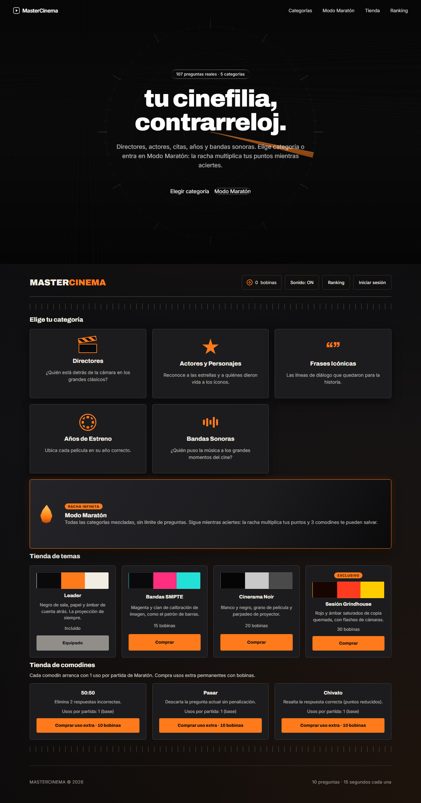
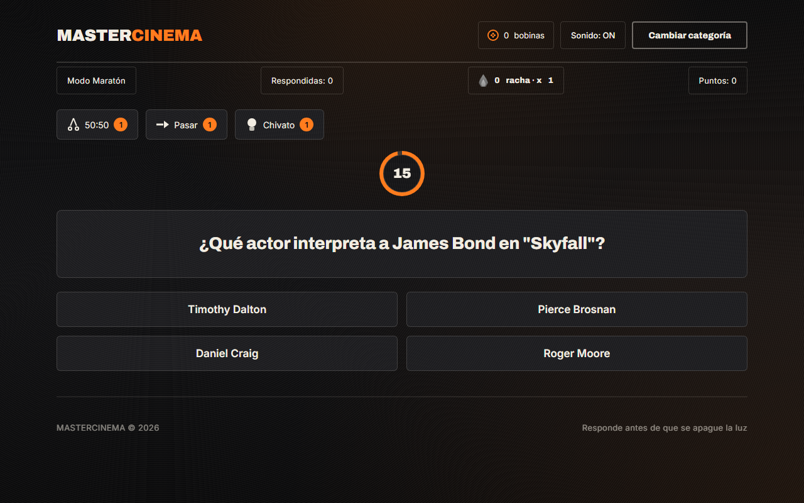
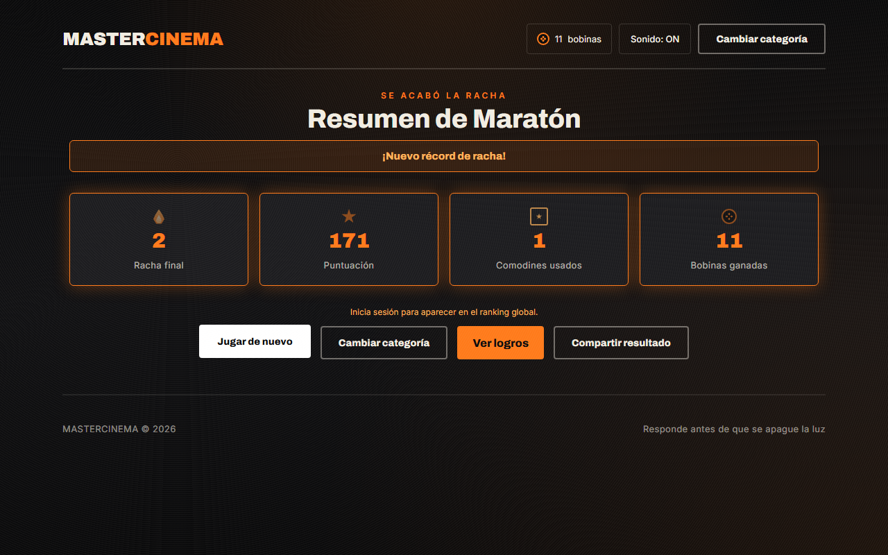
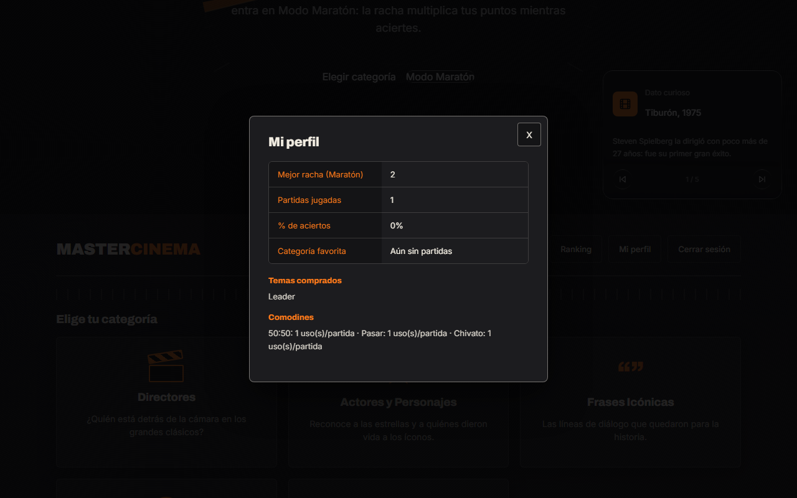

# MasterCinema

[](https://github.com/lucasmarjua-ui/mastercinema/actions/workflows/deploy.yaml)
[](LICENSE)
[](https://lucasmarjua-ui.github.io/mastercinema/)


MasterCinema is a static, responsive film trivia game. Its visual identity is **"Leader"**: the 8-7-6-5 countdown that opens a 35mm print. Cinema black, paper and a single amber accent, concentric circles and heavy geometric type (Archivo + Inter). This is the projection booth, not the red carpet.

The game itself (categories, rounds, shops, accounts, leaderboards) is plain HTML, CSS and vanilla JavaScript with no framework or build step. The one exception is the landing hero, built in React + TypeScript + Tailwind and compiled separately to a static bundle (see [Landing hero](#landing-hero)). The in-game interface is in Spanish.

**[▶ Play now](https://lucasmarjua-ui.github.io/mastercinema/)**

## Screenshots

| | |
|---|---|
|  **Lobby:** categories, Marathon mode and shops |  **Marathon mode:** streak, multiplier and lifelines |
|  **Summary** at the end of a streak |  **My profile:** player statistics |

## Contents

- [Play locally](#play-locally)
- [How to play](#how-to-play)
- [Architecture](#architecture)
- [Question bank](#question-bank)
- [Visual identity: "Leader"](#visual-identity-leader)
- [Game feel and sound](#game-feel-and-sound)
- [Reels, themes and achievements](#reels-themes-and-achievements)
- [Marathon mode and lifelines](#marathon-mode-and-lifelines)
- [Accounts and leaderboards (Firebase)](#accounts-and-leaderboards-firebase)
- [Landing hero](#landing-hero)
- [Technical decisions](#technical-decisions)
- [Deployment](#deployment)
- [Roadmap](#roadmap)

## Play locally

The game has no dependencies or build step, but `index.html` loads the compiled hero from `dist/`, so build it once:

```bash
npm install
npm run build   # writes dist/mastercinema-hero.js and dist/mastercinema-hero.css
```

The site uses native ES modules, so it must be served over HTTP (opening `index.html` from `file://` is blocked by CORS). Serve the root with any static server:

```bash
python -m http.server 8000
```

Then visit `http://localhost:8000`. To work on the hero alone with hot reload, run `npm run dev` (serves `src/hero/dev/` in isolation).

## How to play

1. Pick one of five categories on the home screen: **Directores** (directors), **Actores y Personajes** (actors and characters), **Frases Icónicas** (iconic quotes), **Años de Estreno** (release years) or **Bandas Sonoras** (soundtracks).
2. Answer a round of 10 multiple-choice questions drawn at random from that category. Each question has a 15-second circular timer (ticking for the last 5) and an iris transition to the next one. Running out of time counts as a miss.
3. Correct answers score 50 to 150 points depending on speed, with applause and an amber flash. Misses play a buzzer, shake the button red and reveal the right answer. Misses never subtract points.
4. After 10 questions, the results screen shows hits, misses, score and the **reels** earned (the in-game currency), with buttons to replay, change category or view **achievements**.
5. Reels are spent in the **theme shop**: four complete visual palettes to equip.
6. Logged-in players sync their progress to the cloud and their best scores enter the per-category **global leaderboard**.
7. **Marathon mode** mixes all five categories without repeats until the pool runs out. There is no fixed length: you keep going while you keep answering correctly. The streak multiplies your points, and three lifelines (**50:50**, **Pasar**/skip and **Chivato**/hint) can save an answer.

## Architecture

```text
index.html                 Home: categories, theme shop, login and leaderboards
game.html                  Game screen: questions, timer, results and achievements
shared/theme.css           "Leader" palette, typography, responsive layout and full themes
shared/questions.js        Question bank (107 questions in 5 categories)
shared/quiz-engine.js      Question selection, option shuffling and scoring
shared/audio.js            Applause, buzzer and ticking synthesised with the Web Audio API
shared/wallet.js           "Reels" wallet stored in localStorage
shared/themes.js           Visual theme catalogue, purchases and equipping
shared/achievements.js     Per-category statistics and bronze/silver/gold achievements
shared/firebase-config.js  Firebase config and lazy SDK loader
shared/auth.js             Sign-up, login, guest mode and Firestore sync
shared/leaderboard.js      Global leaderboards (per category and best Marathon streak)
shared/wildcards.js        Marathon lifelines: base uses and extra purchases
firestore.rules            Firestore security rules (reference copy, pasted into the console)
src/hero/                  Landing hero: React + TypeScript + Tailwind
dist/                      Compiled hero bundle from `npm run build` (not committed)
.github/workflows/deploy.yaml   Builds the hero and deploys to GitHub Pages on every push to main
```

## Question bank

`shared/questions.js` contains **107 real, verifiable questions** in five categories. No facts are invented.

| Category | Questions |
|---|---|
| Directors | 25 |
| Actors and Characters | 24 |
| Release Years | 23 |
| Soundtracks | 18 |
| Iconic Quotes | 17 |
| **Total** | **107** |

### Adding questions

Each category is an object with `label`, `description` and `items`. Each item has `q` (the question), `correct` (the right answer) and `wrong` (an array of three wrong options). Neither `game.html` nor `quiz-engine.js` needs to change: the engine builds the round, shuffles the options and recycles the bank if a category has fewer than 10 questions.

A new category also needs no engine changes, because `buildRound` and `createMarathonDeck` read `Object.entries(QUESTIONS)` generically. To give it its own achievements, add its id to `CATEGORIES` in `shared/achievements.js` and to the merge list in `shared/auth.js`.

## Visual identity: "Leader"

The reference is the 35mm countdown leader: cinema black (`--ink`), paper (`--paper`) and amber (`--amber`) as the only brand accent, with concentric circles and tick marks as a recurring motif (dividers, timer, hero background). Type is **Archivo** (800/900) for headings and **Inter** for body and UI, both open-licence Google Fonts.

- **Circular timer** (`.timer-ring`): a `conic-gradient` that empties clockwise with the seconds left shown in the centre, turning red at the end.
- **Iris transition** (`.iris-wipe`): the classic silent-film circular wipe between questions, via an animated `clip-path: circle()`.
- **Pure-CSS icons**: clapperboard, star, quotes, film reel and an equaliser for Soundtracks, all built from gradients, `clip-path` and pseudo-elements with no images.

## Game feel and sound

Every sound is synthesised in real time with the Web Audio API (`shared/audio.js`), with no audio files: applause (filtered noise bursts) for a correct answer, a low buzzer (two detuned oscillators) for a miss, and a tick for the last five seconds of each question. The **Sound** button mutes everything.

## Reels, themes and achievements

Each game awards reels based on the score (`reelsForScore` in `shared/wallet.js`). The shop sells four complete themes, each redefining the whole palette through CSS variables on `[data-theme="id"]`:

| Theme | Price | Look |
|---|---|---|
| **Leader** | Included | Cinema black, paper and amber |
| **Bandas SMPTE** | 15 reels | Calibration magenta and cyan |
| **Cinerama Noir** | 20 reels | Black and white with film grain and projector flicker |
| **Sesión Grindhouse** | 30 reels (exclusive) | Saturated red and amber with camera flashes |

`shared/achievements.js` derives **19 achievements** (three bronze/silver/gold per category plus four for Marathon) from cumulative statistics in `localStorage`, never from separately stored flags. They include a cross-category streak and a meta achievement. **View achievements** on the results screen lists earned and pending ones.

**My profile** (when logged in) shows the best Marathon streak, games played, overall accuracy, favourite category, and owned themes and lifelines, all derived by `getProfileSummary` in `shared/achievements.js`.

## Marathon mode and lifelines

`shared/quiz-engine.js` exposes `createMarathonDeck()` (all five categories shuffled without repeats) and `computeMarathonScore()`, which multiplies base points by the current streak:

| Streak | Multiplier |
|---|---|
| 0–4 | ×1 |
| 5–9 | ×1.5 |
| 10–19 | ×2 |
| 20+ | ×3 |

The combo flash intensifies at the same thresholds, and confetti plus an arpeggio celebrate each new personal best streak (`stats.marathon.bestStreak`, synced to Firestore like the other stats).

Every run starts with one use of each lifeline (`shared/wildcards.js`): **50:50** removes two wrong answers, **Pasar** (skip) discards the question without breaking the streak, and **Chivato** (hint) highlights the right answer for half the base points and no speed bonus. The **lifeline shop** sells permanent extra uses for 10 reels each.

A miss with no lifeline to save it ends the run and shows the **Marathon summary**: final streak, points, lifelines used and reels earned, a new-record notice, and a **Share result** button that copies a short brag to the clipboard. The best streak is also submitted to its own global leaderboard (`marathon-streak` in `leaderboards/`).

## Accounts and leaderboards (Firebase)

MasterCinema uses its own Firebase project (`mastercinema-trivia`, Authentication + Firestore). It is fully playable as a guest, with reels, the equipped theme, statistics and achievements in `localStorage`. **Log in** lets players sign up or log in with a **username and password**; under the hood Firebase Authentication uses a generated `username@mastercinema.local` address, so a real email is never requested. On login, local progress is merged into the `users/{uid}` Firestore document.

After a logged-in game, a score that beats the stored one is written to `leaderboards/{category}/entries/{uid}`. The **Ranking** screen shows the top 10 per category; guests are told they need to log in to appear.

The Firebase SDK is loaded lazily with a dynamic `import()` (`shared/firebase-config.js`). If Google's CDN is blocked by an ad blocker, a corporate proxy or a lost connection, the game still loads and plays as a guest; only accounts and leaderboards are switched off.

### Test account

To try My profile and the leaderboards without signing up: username `cinefilo5050`, password `Prueba12345`.

### Firebase console setup

Firestore and the email/password provider can't be enabled through the API or CLI; each needs one manual click in the console. Without them, login and leaderboards don't work, but the rest of the game does.

1. Open the [project's Firebase console](https://console.firebase.google.com/project/mastercinema-trivia/overview).
2. **Firestore Database → Create database** (pick a region such as `nam5`).
3. **Authentication → Get started → Sign-in method → Email/Password → Enable**.
4. **Authentication → Settings → Authorized domains**: add `lucasmarjua-ui.github.io`.
5. **Firestore Database → Rules**: paste [`firestore.rules`](firestore.rules) and publish.

## Landing hero

The full-screen welcome block at the top of `index.html` is an isolated **React + TypeScript + Tailwind CSS + Vite** component with `lucide-react` icons, and the only part of the project with a build step. It compiles to its own bundle (`dist/mastercinema-hero.js` + `.css`) that `index.html` loads like any other static asset. Vite never touches the rest of the page, which stays vanilla HTML/CSS/JS.

- `CountdownBg.tsx`: an animated background drawn entirely on `<canvas>` (concentric circles, tick marks and a rotating amber wedge, like a countdown sweep). No video or third-party images, and it respects `prefers-reduced-motion`.
- `Hero.tsx`: header, working navigation, mobile menu, staggered headline entrance and a "Did you know?" widget. The entrance uses `fill-mode: backwards`, because `both`/`forwards` leaves a residual `transform` that breaks the `backdrop-filter` on the `.liquid-glass` children.
- `trivia-facts.ts`: the five widget facts are real and consistent with `shared/questions.js`.

Tailwind's **preflight is disabled**, because its global reset would override selectors that `shared/theme.css` already styles for the rest of the page. The few resets the hero needs are scoped to `#hero-root` in `src/hero/index.css`.

The hero's four nav links scroll to the real sections of the page, or open the existing leaderboard dialog. None are placeholders.

## Technical decisions

**No framework or build step, except for the hero.** The game is vanilla HTML, CSS and JavaScript with native ES modules, so GitHub Pages serves the repository almost as-is.

**No third-party images, video or fonts with unclear rights.** There are no film posters or photos of actors: the whole identity (countdown circles, clapperboard, star, quotes, film reel, equaliser) is drawn with CSS and canvas, avoiding binary assets and copyright issues.

**Mobile-first responsive layout.** Flexbox and grid with relative units and `clamp()`, touch targets of at least 44px, and media queries that collapse the category and answer grids to one column on small screens without horizontal scrolling.

## Deployment

The `.github/workflows/deploy.yaml` workflow installs dependencies, builds the hero (`npm ci && npm run build`) and publishes the repository, including the fresh `dist/`, to GitHub Pages on every push to `main`. Pages must be enabled once under **Settings → Pages → Source: GitHub Actions**.

The site is live at <https://lucasmarjua-ui.github.io/mastercinema/>.

## Roadmap

- Keep growing the question bank
- New categories (posters by silhouette, scenes by description)
- In-game notifications for newly unlocked achievements
- A daily question with a special reward
- Game history in My profile

## License

MIT. Copyright Lucas Martinez, 2026. See [LICENSE](LICENSE).
